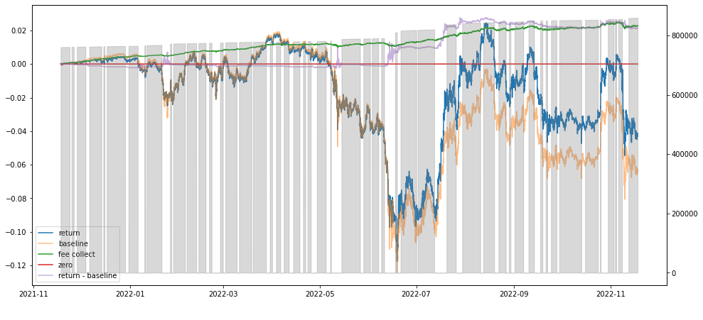
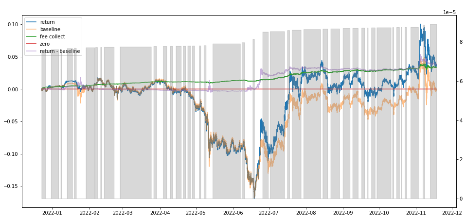

Liquidity Providing from Farming to Speculating
====================================================================================================
When the first time I provide liquidity to a swap pair, I feel I am farming. But soon I realized I am speculating. Because of the impermanent loss, providing liquidity is more speculating than farming. I guess some people have the same experiences and feelings like this. Then the question is how can we speculate it?

Providing liquidity is to short the volatility.
-----------------------------------------------------------------
There is no AMM liquidity provider in traditional finance, and there is no methodology about this. Everything is rather new. Can we find a concept in traditional finance to help us understand liquidity providing as a speculator and transfer the knowledge in traditional finance to help us in this new topic? Earlier this year, I wrote a `tool <https://www.poption.exchange/tools/il>`_  to help people calculate the impermanent loss in v3 or v2 Uniswap pool. The impermanent loss looks like this.

.. image:: ../images/il_payoff_2.png
    :align: center
    :width: 80 %

If we want to hedge the loss, we should buy something that gives us more value when the price goes much lower or higher, which is longing the volatility. In other words, providing liquidity is to short the volatility. When the price value of the pair does not change heavily, liquidity providers earn more fees than the loss; otherwise, liquidity providers lose more than the earning fee.

A simple liquidity-providing strategy
------------------------------------------------------------------
We should provide liquidity when the volatility is going to be low and remove liquidity when the volatility is going to be high. Consider a simple strategy like this.

* Add liquidity into the pool as usual.
* When the volatility increases, remove the liquidity from the pool.
* When the volatility is low, swap the tokens and add the liquidity back to the pool.

We call the period that the liquidity is not in the pool escaping period. If the pool collects less fee than the impermanent loss in this period, the strategy makes more money than simply continually providing liquidity. The impermanent loss comes from selling more precious tokens at a poorer price. By escaping the high volatility period, we do not sell tokens at a poorer price, instead, we sell them at a fair price (though suffering some fee).

Currently, some simple MACD style volatility indexes are enough to support the strategy. When the volatility is high, we leave the pool and when the volatility is low, we enter the pool.

Strategy backtesting
------------------------------------------------
Do some simple backtesting, it shows that even a simple strategy can outperform the baseline with about 300 bp in a year. Notice that the drawdown of the strategy is low for it is only the missed fee when the liquidity is not in the pool. Although the result is not strong, it is a significant improvement compared to leaving the asset in the liquidity pool. It also shows that, we can speculate on providing liquidity.

    The backtesting result of USDC-WETH 0.05% Uniswap v3 pool with a full range of liquidity on Ethereum. The "return" line is the strategy return compared to holding the asset. The "baseline" is the return of always providing liquidity and continuously adding the collected fee to the poll. The "Zero" means holding the asset and do not add it to the pool all the time. The "Return - baseline" is the difference between the strategy return and the baseline.  The "Fee collected" line indicates the fee collected by the strategy. The grey area means the liquidity in the pool.

    The backtesting result of WMATIC-USDC 0.05% Uniswap v3 pool with a full range of liquidity on Polygon.

From whom the money comes? In this strategy, the money comes from the arbitrager. They earn less from the liquidity provider. The pool becomes more sensitive to price change and this helps the market to find out the price quicker. The strategy also benefits the rest liquidity provider in the pool because it may earn more fees now.

Future Work
--------------------------------
I will release some services including backtesting to help people optimize their liquidity providing. I will also try to find some better signals to add and remove liquidity and work out the methodology of the liquidity providing. I also think a liquidity lending platform will be helpful for people to make money from predicting volatility and sharing the return with the original liquidity provider.
