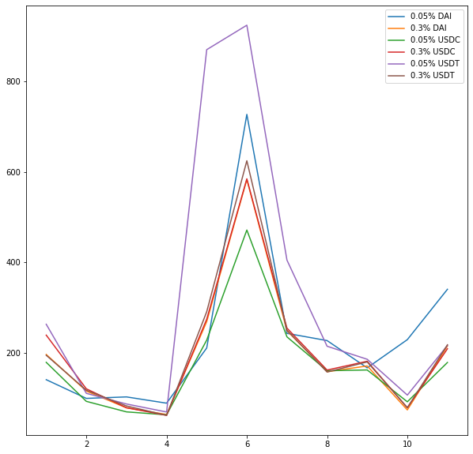

Compare Fees of Different Pools of the Same Swap Pair
=========================================================
Which pool should I pick when I add assets into a liquidity pool?  There are too many choices. There are different fee rates, different chains, and even different stablecoins, even after we made the decision on which pair to add into. When the first time I added liquidity into the pool, I made this decision almost blindly based on a hypothesis that the market is efficient and others will test these different pools with their money. I can pick an arbitrarily popular pool and the return shall be similar to other pools.

Fee Collected by Per Unit of Liquidity for Each Pool
-------------------------------------------------------------------------
In the Uniswap v3 pool, the variables `feeGrowthGlobal0X128` and `feeGrowthGlobal1X128` record the fee collected per unit of liquidity in the pool. It only depends on the price change of the pair. So we can calculate the fee easily with swap event data. I compare the fee collected by WETH-(USDC/USDT/DAI) pair on Ethereum, they share the same price and are the most important pools in Uniswap. Because of sharing the same price, the liquidity providers share the same impermanent loss. The fee collected should be the most important reason that affects people's choice.

Here is the result:

    The fee collected per unit of liquidity in each month this year. The labels of the lines is in format of "$fee_rate $stable_coin".

It seems the hypothesis is partially proved. No pool collects significantly low fees. But, there are still two pools that earn significantly high fees. The '0.05% USDT' pool and the '0.05% DAI' pool collect more fees than others. It may be caused by big MEV transactions like `this <https://etherscan.io/tx/0x5550809304222949d0795f82bbb5ac7d76209c0f54325dc2e02d6a4a4da7e26b>`_. These transactions create a long pin bar in the price chart and give high fees to liquidity providers with a wide active range. This may be the reason ordinary people who usually provide a narrow range of liquidity failed to take the advantage of these two pools.
